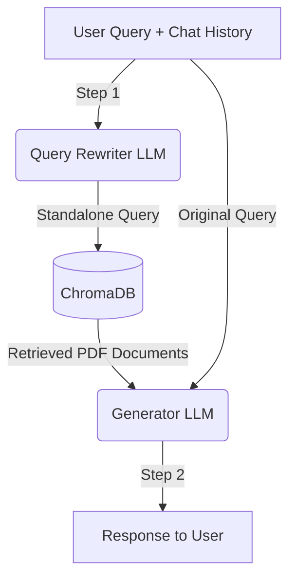

# 🤖 Conversational RAG Engine (Smart Assistant)

[](https://www.python.org/downloads/)
[](https://python.langchain.com/)
[](https://www.trychroma.com/)
[](https://github.com/astral-sh/uv)

A modern **Retrieval-Augmented Generation (RAG)** system built on the **LCEL (LangChain Expression Language)** architecture. Thanks to its universal approach, the system can analyze any PDF documents and accurately answer questions based on their content.

The system features **contextual memory** – under the hood, it utilizes two independent chains (a "History-Aware Retriever"). This allows it to seamlessly handle multi-threaded conversations and correctly interpret pronouns (e.g., *"Who do I report this to?"*) based on the chat history.

---

## ✨ Key Features

* **Incremental Load & Document Updates:** The system features a Smart File Tracker that calculates file hashes in the `data/raw/` directory. It automatically detects new files, skips already processed ones, and **updates the vector database only for documents whose content has changed**. This guarantees ultra-fast synchronization without the need to re-ingest the entire knowledge base.
* **Conversational Memory:** Context-aware query rewriting using an LLM ensures the vector search engine always receives a standalone, fully-contextualized query, resulting in highly accurate retrievals.
* **Modern LCEL Architecture:** Built entirely with LangChain Expression Language (LCEL). The data flow relies on declarative streams (Runnables), ensuring the codebase is highly readable, maintainable, and easy to scale.
* **Modularity (Separation of Concerns):** The codebase is strictly divided into logical components: `pipeline` (ingestion and tracking), `processing` (chunking algorithms), and `rag` (the core AI engine).
* **Local Vector Database:** Powered by ChromaDB for fast, free, and secure on-disk semantic search. No external vector cloud services are required.

---

## 🏗️ Data Flow Architecture

The project employs a modern State-of-the-Art approach involving two LLM calls per user question:


---

## 🛠️ Tech Stack

* **AI Engine:** LangChain (Core & OpenAI)
* **Models:** `gpt-5-mini` `gpt-4o-mini` (Generation) & `text-embedding-3-small` (Embeddings)
* **Vector Store:** ChromaDB
* **PDF Parsing:** `pypdf`
* **Package Manager:** `uv`

---

## 🚀 Installation & Usage

### 1. Clone the repository & Install dependencies
This project uses `uv`, an incredibly fast Python package manager.

```bash
# Clone the repository
git clone [https://github.com/YourUsername/rag-project.git](https://github.com/YourUsername/rag-project.git)
cd rag-project

# Install dependencies using uv (or from requirements.txt)
uv sync
```
### 2. Environment Setup
Create a `.env` file in the root directory of the project and add your OpenAI API key:

```env
OPENAI_API_KEY=sk-your-secret-openai-key
```
### 3. Knowledge Ingestion
Drop your PDF files into the `data/raw/` directory.
Run the ingestion pipeline (the script will automatically split the files and build the vector database):

```bash
python -m src.pipeline.ingestion
```
### 4. Running the Application
You can interact with the system in two ways:

**Option A: Terminal Interface (CLI) - Main Interface**

```bash
python -m src.main
```
---
## 📁 Project Structure

```text
rag_project/
├── data/
│   ├── chroma_db/            # Local vector database (SQLite + embeddings)
│   ├── raw/                  # Directory for input PDF files
│   └── processed_files.json  # Registry of ingested files (File Tracker)
├── src/
│   ├── pipeline/
│   │   ├── file_tracker.py   # Logic for tracking file changes
│   │   └── ingestion.py      # Main script feeding the vector DB
│   ├── processing/
│   │   └── chunking.py       # Logic for splitting text into chunks
│   ├── rag/
│   │   ├── generator.py      # Main RAG chain with LCEL conversational memory
│   │   ├── retriever.py      # Search engine configuration for ChromaDB
│   │   └── vector_store.py   # ChromaDB and Embeddings initialization
│   ├── app.py                # Optional Streamlit interface (UI)
│   └── main.py               # Main terminal application loop (CLI)
├── .env                      # Environment variables (API keys)
├── .gitignore                # Ignored files (including .env and app.py)
├── pyproject.toml            # Modern Python project configuration
├── requirements.txt          # Dependency list (Generated by uv)
└── uv.lock                   # Dependency version lockfile (uv)
```
---
## 🔮 Roadmap

- [ ] Wrap the RAG engine in a REST API using FastAPI.
- [ ] Implement an `/ingest` endpoint for dynamic file uploads via API.
- [ ] Containerize the entire environment using Docker and `docker-compose`.